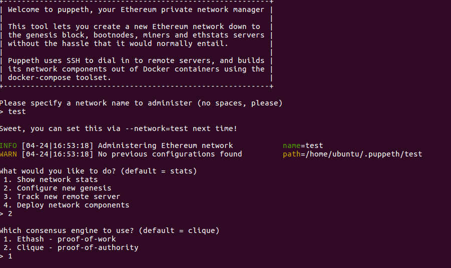
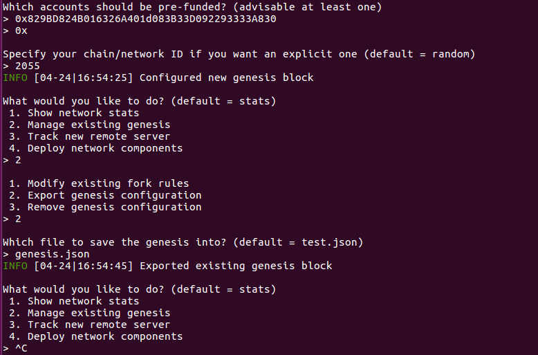

# 搭建以太坊私链/运行智能合约

## 私链搭建（基于ubuntu，geth（以太坊go客户端））

### 安装geth

#### PPA安装(建议)
```bash
sudo apt-get install software-properties-common
sudo add-apt-repository -y ppa:ethereum/ethereum
sudo apt-get update
sudo apt-get install ethereum
```
成功安装后，运行geth --help可以出现命令行提示

#### 编译源码/安装（建议）
```bash
git clone https://github.com/ethereum/go-ethereum
```
编译go-ethereum需要安装go1.7或以上版本，c编译器

安装geth
```bash
make geth
```

安装所有命令
```bash
make all
```
生成的所以命令均在$go-ethereum/build/bin  

#### docker安装
首先安装docker，可以参考[docker ce安装教程](https://docs.docker.com/install/linux/docker-ce/ubuntu/)
```bash
docker pull ethereum/client-go
```

完成后，可以运行以docker方式运行以太坊客户端。

### 生成创世块genesis.json
源码编译时，会生成puppeth命令，可以直接使用该命令生成创世块配置文件。  
```bash
cd build/bin //进入puppeth命令所在目录
./puppeth  //运行命令
```
配置如图所示：



